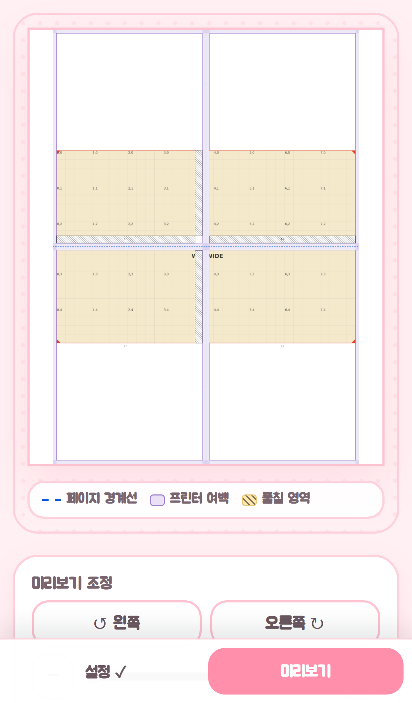
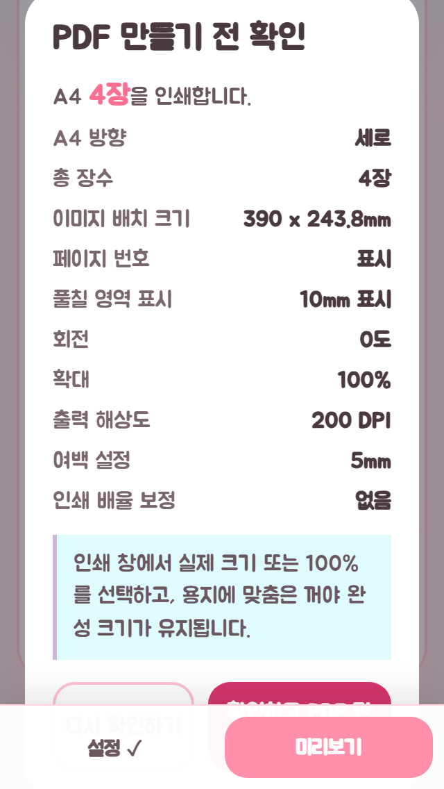
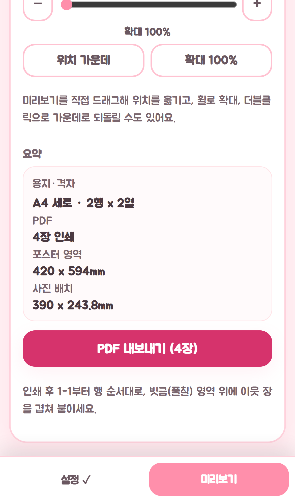
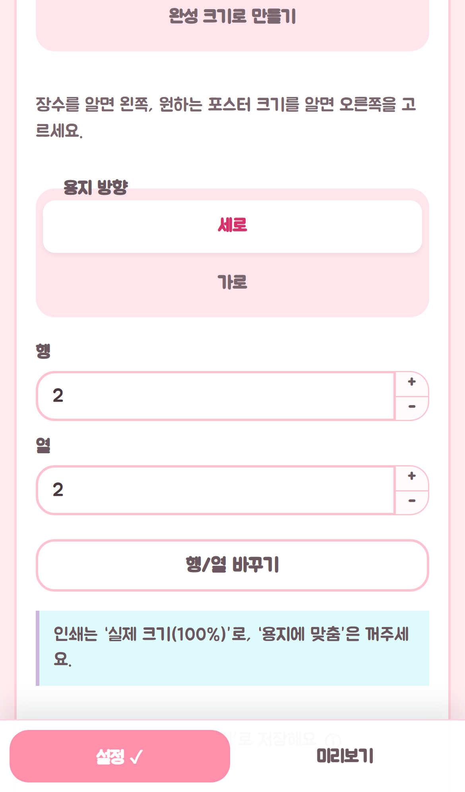
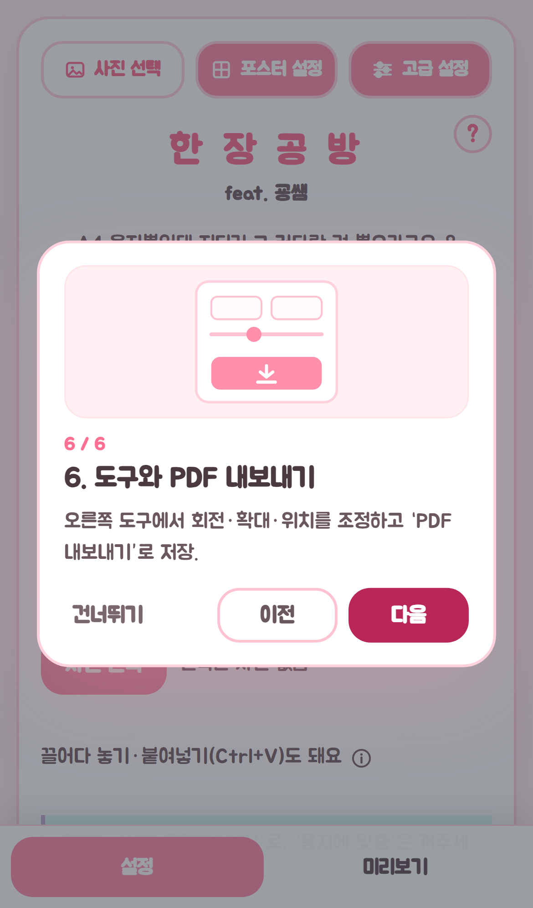
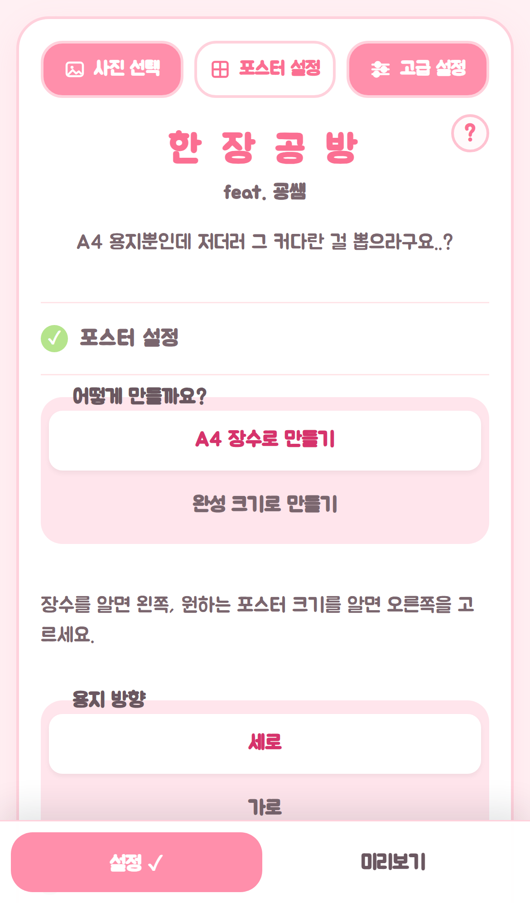
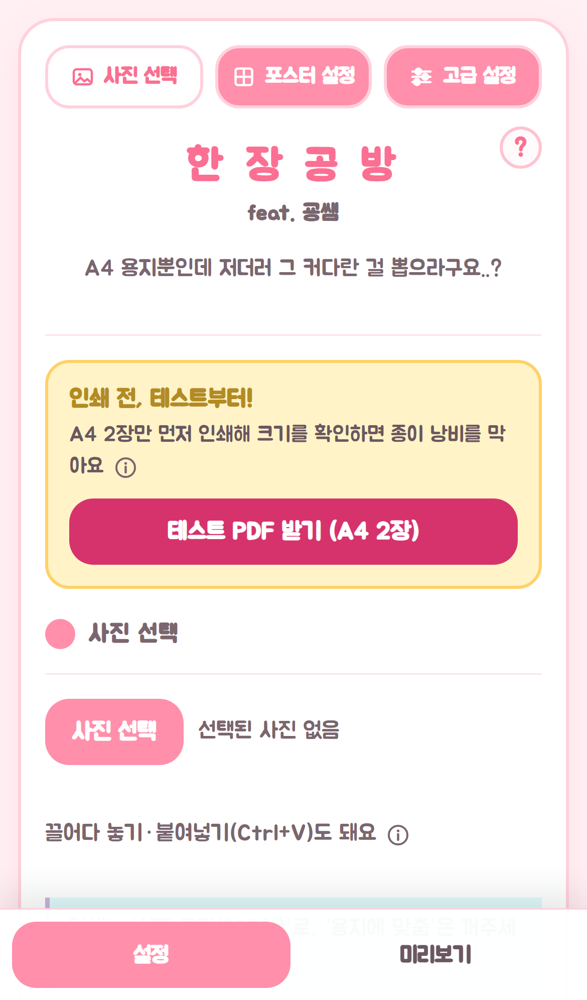
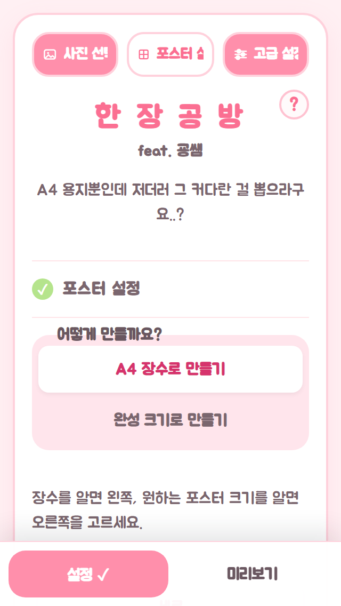
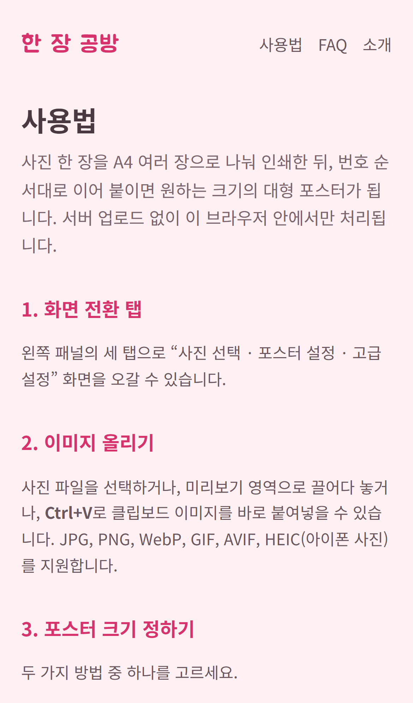

# 모바일 사용성 점검 보고서 (한 장 공방)

- 점검일: 2026-08-18
- 방법: Playwright 기기 에뮬레이션(`hasTouch: true`)으로 실제 터치 이벤트(CDP `Input.dispatchTouchEvent`)를 발생시켜 업로드 → 설정 → 미리보기 → 내보내기 전 과정을 조작
- 대상 뷰포트
  - iPhone 13 (390 × 664 CSS px)
  - iPhone 13 Mini (375 × 629)
  - iPhone SE (320 × 568)
- 대상: `http://127.0.0.1:5173` (dev 서버), `guide.html` / `faq.html` 포함
- 스크린샷: [`mobile-usability-screenshots/`](./mobile-usability-screenshots/)

> 코드는 수정하지 않았습니다. 진단 + 수정 제안만 담았습니다.

---

## 1. 요약

사용자가 말한 "약간 불편한 느낌"의 정체는 **단일 버그가 아니라 핵심 동선(업로드 → 설정 → 내보내기) 전체에 걸친 터치 마찰**입니다. 영향도 순으로 상위 5개:

1. **미리보기 캔버스가 페이지 스크롤을 완전히 삼킵니다.** `.preview-canvas`에 무조건 `touch-action: none`이 걸려 있어, 화면의 62%를 차지하는 캔버스 위에서 위로 쓸어올리면 **스크롤이 0px** 움직입니다(캔버스 바로 아래에서 같은 제스처를 하면 235px 스크롤됨). "미리보기" 탭에서 회전·확대·**PDF 내보내기** 버튼에 가려면 반드시 캔버스를 피해 좁은 여백에 엄지를 대야 합니다. → 체감상 "화면이 안 움직인다 / 먹통이다"

2. **작은 화면(높이 ≲ 600px)에서는 PDF를 내보낼 수 없습니다.** 내보내기 확인 모달의 `확인하고 PDF 만들기` 버튼 위를 모바일 하단 탭바(`z-index: 20`)가 덮습니다(모달 백드롭은 `z-index: 10`). iPhone SE에서 그 지점을 탭하면 **모달이 아니라 하단 탭의 "미리보기"가 눌립니다.** 자동화 탭도 "element is obscured"로 실패했습니다. 모달에 `max-height`/스크롤도 없어 제목까지 잘립니다.

3. **행/열 스테퍼(+/−)가 28 × 21 px입니다.** 앱에서 가장 자주 누르는 컨트롤인데 권장 44px의 절반도 안 되고, +와 − 사이 오차 허용치가 세로 ±10px뿐입니다. 왼쪽 20px 지점은 텍스트 입력이라 잘못 누르면 키보드가 올라옵니다. 정작 값 입력창은 한 자리 숫자에 302px를 씁니다.

4. **PC 기준으로 쓰인 안내 문구가 모바일 화면과 어긋납니다.** 세로로 쌓인 두 버튼 옆에 "장수를 알면 **왼쪽**, … **오른쪽**을 고르세요", 마우스가 없는데 "**휠**로 확대, **더블클릭**으로 가운데로", "**오른쪽** 도구의 PDF 내보내기" 등. 첫 방문 투어 6단계 중 3개가 이런 문구입니다.

5. **모든 탭에서 로고 블록이 화면을 잡아먹고, 탭 활성 색이 반전되어 보입니다.** `.title-block`(139px)이 사진 선택/포스터 설정/고급 설정 3개 탭 모두에서 반복되고, 하단 탭바까지 합치면 664px 중 실제 컨트롤 영역은 절반 이하입니다. 게다가 **활성 탭이 흰색, 비활성 탭이 진한 분홍**이라 3개 중 2개가 "선택된 것처럼" 보입니다.

---

## 2. 상세 발견 사항

### 🔴 P1-1. 미리보기 캔버스 위에서 페이지가 스크롤되지 않음

**무엇을 했나** — iPhone 13, 사진 업로드 후 하단 탭 "미리보기" → 캔버스 한가운데(195, 233)에서 위로 250px 스와이프.

**무슨 일이 일어났나**

| 스와이프 시작 지점 | scrollY 변화 |
|---|---|
| 캔버스 위 (`.preview-canvas`) | 0 → **0** (전혀 안 움직임) |
| 캔버스 바로 아래 (범례 영역) | 0 → **235** |

캔버스는 26,26 위치에 **338 × 414 px** — 664px 뷰포트의 62%입니다. 그 아래 문서 전체 높이는 1297px이고 `PDF 내보내기` 버튼은 y ≈ 1150 부근에 있습니다(스크린샷 [15](./mobile-usability-screenshots/15-preview-scrolled-bottom.png)). 즉 **주요 동작에 도달하려면 두 화면 분량을 스크롤해야 하는데, 화면의 절반 이상이 스크롤 데드존**입니다.



**원인** — `src/App.css:959-968`

```css
.preview-canvas {
  ...
  touch-action: none;   /* ← 무조건 적용 */
}
.preview-canvas.is-draggable { touch-action: none; }   /* 970-973 */
```

`.is-draggable`용 규칙(970행)과 모바일 블록의 동일 규칙(1240-1242행)이 따로 있는 걸 보면 **원래 의도는 "드래그 가능할 때만" 이었는데 기반 규칙(967행)이 이미 전부를 덮고 있습니다.** 위 테스트에서 캔버스는 `class="preview-canvas "` (`is-draggable` 없음, `canPan === false`)였는데도 스크롤이 죽었습니다.

**수정 제안**

1. 967행의 `touch-action: none`을 **삭제**하고, 팬 가능할 때만 적용:
   ```css
   .preview-canvas { touch-action: pan-y pinch-zoom; }  /* 세로 스크롤은 브라우저에 양보 */
   .preview-canvas.is-draggable { touch-action: none; }
   ```
   `pan-y`를 남기면 확대 전에는 세로 스크롤이 살아나고, 핀치는 `useCanvasZoom`의 `touchmove` 핸들러가 그대로 받습니다.
2. 그래도 확대 상태(`is-draggable`)에서는 데드존이 생기므로, **모바일에서는 `PreviewToolbar`/내보내기 버튼을 캔버스 아래 먼 곳이 아니라 화면에 고정**하는 편이 안전합니다 → P1-3 참조.

---

### 🔴 P1-2. 작은 화면에서 "확인하고 PDF 만들기"를 하단 탭바가 가림

**무엇을 했나** — iPhone SE(320 × 568), 사진 업로드 → 미리보기 → `PDF 내보내기 (4장)` 탭 → 확인 모달에서 `확인하고 PDF 만들기` 탭.

**무슨 일이 일어났나** — Playwright 탭이 `Timeout 2500ms exceeded`로 **실패**했습니다. `document.elementFromPoint()`로 버튼 중심을 찍으면 반환값이 `.mobile-bottom-nav button.active`, 즉 **하단 탭바의 "미리보기" 버튼**입니다. 실제 폰에서는 확인을 누르려다 미리보기 탭이 눌리는 셈입니다.



측정값:

| 기기 | 뷰포트 높이 | 모달 높이 | 확인 버튼 bottom | 탭바 top | 결과 |
|---|---|---|---|---|---|
| iPhone SE | 568 | **582** (뷰포트 초과) | 555 | **507** | ❌ 48px 가려짐, 탭 실패 |
| iPhone 13 Mini | 629 | 562 | 575 | 568 | ⚠️ 7px 겹침 (아슬아슬) |
| iPhone 13 | 664 | 538 | 581 | 603 | ✅ 22px 여유 |

추가 문제 두 가지:
- 모달 자체가 뷰포트보다 큽니다(582 > 568). `.modal-backdrop`은 `overflow: visible`, `.confirm-modal`은 `max-height: none`이라 **스크롤로 복구할 방법이 없습니다.** `align-items: center` 때문에 제목 `PDF 만들기 전 확인`도 위로 7px 잘려 나갑니다.
- 모달이 열려 있는 동안 **배경 페이지가 그대로 스크롤됩니다**(`document.body { overflow: visible }` 확인). 모달 뒤에서 캔버스가 미끄러지는 게 보입니다.

**원인** — `src/App.css`
```
1024  .modal-backdrop { position: fixed; inset: 0; z-index: 10; display:flex; align-items:center; }
1035  .confirm-modal  { width: min(27.5rem, 100%); padding: 1.25rem; }   /* max-height 없음 */
1249  .mobile-bottom-nav { ... z-index: 20; }                            /* 모달보다 위 */
```
`ExportConfirmModal.tsx` / `AdvancedHelpModal.tsx` 둘 다 이 백드롭을 씁니다.

**수정 제안**

1. **z-index 역전 해소** — `.modal-backdrop`을 하단 탭바 위로:
   ```css
   .modal-backdrop { z-index: 30; }   /* .mobile-bottom-nav(20) 위, .onb-root(50) 아래 */
   ```
2. **모달을 뷰포트 안에 가두고 내부 스크롤 부여**:
   ```css
   .confirm-modal {
     max-height: calc(100dvh - 2rem);
     overflow-y: auto;
     overscroll-behavior: contain;
   }
   ```
3. **액션 버튼을 모달 안에 sticky 고정** — 목록이 길어져도 CTA는 항상 보이게:
   ```css
   .modal-actions {
     position: sticky; bottom: 0;
     margin: 0 -1.25rem -1.25rem;   /* .confirm-modal padding 상쇄 */
     padding: 0.75rem 1.25rem calc(0.75rem + env(safe-area-inset-bottom));
     background: var(--c-surface);
     box-shadow: 0 -6px 12px rgba(31,41,51,0.06);
   }
   ```
4. **배경 스크롤 잠금** — `App.tsx`에서 `isConfirmOpen`일 때 `document.body.style.overflow = 'hidden'` (혹은 `.modal-open` 클래스) 토글.

> 참고: 실제 iOS Safari는 주소창이 펼쳐진 상태에서 뷰포트가 더 줄어들고, 가로 모드에서는 훨씬 작아집니다. 즉 iPhone 13에서도 조건에 따라 이 문제에 걸릴 수 있습니다.

---

### 🔴 P1-3. `PDF 내보내기`가 항상 두 화면 아래에 있음

**무엇을 했나** — 미리보기 탭에서 내보내기 버튼까지 도달.

**무슨 일이 일어났나** — 미리보기 탭의 문서 높이는 **1297px / 뷰포트 664px**. 위에서부터 캔버스(414) → 범례 → `tools-panel`(695px: 회전 → 확대 슬라이더 → 위치 가운데 → 안내문 → 요약 6줄 → **PDF 내보내기**) 순서라, 최종 동작이 **가장 마지막**에 있습니다. 게다가 P1-1 때문에 그 스크롤조차 캔버스를 피해서 해야 합니다.



**원인** — `src/App.css:1169-1172`에서 모바일은 `.tools-panel { position: static }`으로 데스크톱 사이드바를 그대로 세로 스택합니다. `PreviewSidebar.tsx`의 DOM 순서(조정 → 요약 → 내보내기)가 그대로 화면 순서가 됩니다.

**수정 제안** — 모바일에서 내보내기 그룹만 하단 고정 바로 승격:
```css
@media (max-width: 860px) {
  .export-group {
    position: fixed;
    right: 0; bottom: 3.8125rem;   /* .mobile-bottom-nav 높이(61px) 바로 위 */
    left: 0;
    z-index: 15;
    padding: 0.5rem 0.75rem;
    background: var(--c-surface);
    border-top: 1px solid var(--c-border);
  }
  /* 겹침 방지 */
  .app-shell { padding-bottom: 9rem; }
}
```
대안(더 가벼움): `.tools-panel`에 `display: flex; flex-direction: column`을 주고 `.export-group { order: -1 }`로 **요약보다 위**로 올리기. 최소한 "캔버스 → 내보내기 → 세부 조정" 순서가 되어 한 번의 스크롤로 닿습니다.

---

### 🟠 P2-1. 행/열 스테퍼(+/−)가 너무 작고 오탭이 쉬움

**무엇을 했나** — 사진 업로드 후 포스터 설정에서 `행` 값을 +/− 로 조정.

**무슨 일이 일어났나** — 측정값:

```
행 입력창 : 302 × 42 px   (한 자리 숫자에 302px)
[+] 버튼  :  28 × 21 px   (중심 y=321)
[−] 버튼  :  28 × 21 px   (중심 y=342)
→ +/− 경계 y=332. + 를 노린 탭이 11px만 아래로 밀려도 − 가 눌림.
→ + 중심에서 왼쪽 20px 지점 = <input> (탭하면 키보드가 올라옴)
```

즉 유효 타깃은 **28 × 21 px**, 세로 오차 허용 ±10px. 성인 엄지 접촉면(대략 40 CSS px)보다 훨씬 작습니다. Apple/Google 권장은 44 × 44 px입니다.



같은 컴포넌트가 고급 설정의 `풀칠 폭`, `여백`, `실측값`, 완성 크기 모드의 `가로/세로 mm`에도 전부 쓰입니다.

**원인** — `src/App.css:406-431`
```css
.number-input-control { grid-template-columns: minmax(0,1fr) 1.75rem; }  /* 28px */
.number-stepper       { grid-template-rows: 1fr 1fr; }                    /* 세로 2분할 */
.number-stepper button{ min-height: 1.3125rem; }                          /* 21px */
```
`src/components/NumberField.tsx`의 `inputMode="decimal"`은 잘 지정되어 있어 키패드 자체는 정상입니다.

**수정 제안** — 모바일에서 스테퍼를 **입력창 양옆 가로 배치**로 뒤집기:
```css
@media (max-width: 860px) {
  .number-input-control {
    grid-template-columns: 2.75rem minmax(0, 1fr) 2.75rem;
  }
  .number-stepper {
    display: contents;              /* 두 버튼을 그리드 셀로 풀어놓기 */
  }
  .number-stepper button           { min-height: 2.75rem; font-size: 1.125rem; }
  .number-stepper button:first-child { grid-column: 3; border-radius: 0 var(--r-sm) var(--r-sm) 0; border-left: 0; }
  .number-stepper button:last-child  { grid-column: 1; border-radius: var(--r-sm) 0 0 var(--r-sm); border-right: 0; border-left: 1px solid var(--c-border-2); }
  .number-input-control input        { grid-column: 2; border-radius: 0; text-align: center; }
}
```
(`−` 왼쪽 / 값 가운데 / `+` 오른쪽 — 모바일 수량 입력의 표준 패턴이고, 44px 타깃 두 개가 서로 302px 떨어져 오탭이 사실상 사라집니다.)

---

### 🟠 P2-2. 데스크톱 기준 문구가 모바일 레이아웃과 모순

**무엇을 했나** — 첫 방문 투어 6단계 완주 + 각 설정 화면 문구 확인.

**무슨 일이 일어났나** — 모바일에서는 좌/우 패널이 없고 마우스도 없는데 문구는 그대로입니다.

| 위치 | 문구 | 모바일 실제 |
|---|---|---|
| `SizingModeSection.tsx:30` | "장수를 알면 **왼쪽**, … **오른쪽**을 고르세요" | 두 버튼이 **위/아래**로 쌓임 (`@media (max-width:480px)`의 `.segmented{grid-template-columns:1fr}`) |
| `PreviewSidebar.tsx:134` | "**휠**로 확대, **더블클릭**으로 가운데로" | 휠·더블클릭 없음. 실제로는 핀치 |
| `SettingsPanel.tsx:240` | "**오른쪽 도구**의 PDF 내보내기로 저장해요" | 오른쪽 패널 없음 (바로 아래 `InfoHint`에만 모바일 안내가 숨어 있음) |
| `Onboarding.tsx:29` | "**왼쪽의 세 탭**으로 …" | 상단 가로 탭 |
| `Onboarding.tsx:61` | "**휠·슬라이더**로 확대, 드래그로 위치" | 휠 없음 |
| `Onboarding.tsx:68` | "**오른쪽 도구**에서 회전·확대…" | 아래로 스크롤 |
| `ImageUploadSection.tsx:41,43` | "끌어다 놓기·붙여넣기(**Ctrl+V**)", "**오른쪽** 미리보기 영역에" | 둘 다 모바일에서 불가 |
| `EmptyPreview.tsx:6` | "**왼쪽** '사진 선택' 탭에서 고르세요" | 하단 탭 |




**수정 제안** — 방향 대신 **이름으로 지칭**하면 한 벌의 문구로 양쪽 다 맞습니다.
- "장수를 알면 **'A4 장수로 만들기'**, 원하는 크기를 알면 **'완성 크기로 만들기'** 를 고르세요."
- "미리보기를 **드래그해 위치를 옮기고, 두 손가락으로 벌려 확대**할 수 있어요." (데스크톱용 휠 안내는 `@media (hover: hover)` 조건부 문구 또는 `matchMedia('(pointer: coarse)')` 분기)
- "**'미리보기' 탭의 'PDF 내보내기'** 로 저장해요."
- `Onboarding.tsx`는 이미 `useSpotlight` 플래그로 860px 분기를 하고 있으므로, **같은 플래그로 `body` 문구도 모바일판/데스크톱판을 골라 쓰면** 구조 변경 없이 해결됩니다.
- `Ctrl+V` 안내는 `pointer: coarse`에서 숨기기.

---

### 🟠 P2-3. 탭 활성 상태가 반대로 읽힘 + 320px에서 라벨 잘림

**무엇을 했나** — 상단 3탭(사진 선택 / 포스터 설정 / 고급 설정) 전환.

**무슨 일이 일어났나** — 활성 탭이 **흰 배경 + 얇은 테두리**, 비활성 탭이 **진한 분홍 채움**입니다. 가로 3분할 세그먼트로 보이는 모바일에서는 "채워진 게 선택된 것"으로 읽히므로 **3개 중 2개가 선택된 것처럼** 보입니다.



320px 폭에서는 `overflow: hidden; white-space: nowrap` 때문에 라벨이 잘립니다 (`포스터 설정`: 필요 60px / 가용 44px → "포스터 실"):



**원인** — `src/App.css`
```
1534  .panel-view-tab                     { background: var(--c-brand); color:#fff; overflow:hidden; white-space:nowrap; }
1555  .panel-view-tab[data-active='true'] { background: var(--c-surface); color: var(--c-brand-strong); }
1132  @media(max-width:860px) .app-shell .panel-view-tab { /* 크기·테두리만 재정의, 색 로직은 그대로 */ }
```
데스크톱에서는 세로 엣지 탭이라 "흰색 = 패널과 이어짐"이 타당하지만, 모바일 가로 탭에는 그 은유가 없습니다.

**수정 제안** — 모바일 블록(1132행 근처)에서 색을 반전:
```css
@media (max-width: 860px) {
  .app-shell .panel-view-tab {
    background: var(--c-surface);
    color: var(--c-brand-strong);
    border-color: var(--c-border);
  }
  .app-shell .panel-view-tab[data-active='true'] {
    background: var(--c-brand);
    border-color: var(--c-brand);
    color: #fff;
  }
}
```
라벨 잘림은 아이콘을 `@media (max-width: 360px)`에서 숨기거나(`.panel-view-tab svg { display:none }`) 라벨 `font-size: 0.8125rem` + `padding: 0.625rem 0.25rem`로 완화.

---

### 🟡 P3-1. 모든 탭에서 로고 블록이 화면을 차지

**무엇을 했나** — 각 탭의 첫 화면에서 실제 컨트롤이 나오는 y좌표 측정.

**무슨 일이 일어났나** — iPhone 13(664px) 기준:

```
탭 바          y  30 –  72   (42px)
.title-block   y  84 – 223   (139px)  ← "한 장 공방" + "feat. 굥쌤" + 태그라인
.test-print-callout y 239 – 391 (152px)
.view-panel    y 411 – 581            ← 여기서야 "사진 선택" 등장
.mobile-bottom-nav  y 603 – 664
```

첫 화면의 **첫 60%가 로고와 부가 안내**이고, 정작 앱의 첫 동작인 "사진 선택"은 화면 맨 아래 한 조각에 걸립니다. `.title-block`은 **고급 설정 탭에서도 그대로 반복**되어(스크린샷 [30](./mobile-usability-screenshots/30-advanced-seamtest-top.png)) 탭을 바꿀 때마다 로고를 다시 지나쳐 스크롤해야 합니다.

부수 문제: 첫 화면에서 시각적으로 가장 강한 버튼이 **`테스트 PDF 받기 (A4 2장)`**(노란 콜아웃 + 진한 마젠타 채움)이고, 실제 주요 동작인 `사진 선택`은 연한 분홍입니다. 첫 방문자가 위쪽 버튼을 먼저 누르면 필요 없는 PDF가 받아지고 `SettingsPanel.tsx:171-174`에 따라 **고급 설정 탭으로 튕겨 나갑니다.**

**수정 제안**
```css
@media (max-width: 860px) {
  .title-block h1      { font-size: 1.375rem; letter-spacing: 0.1em; }
  .title-block p       { display: none; }        /* 태그라인·크레딧은 접기 */
  .title-credit        { display: none; }
  .title-block         { margin-bottom: 0.5rem; }
}
```
그리고 `SettingsPanel.tsx`에서 `.title-block`을 `view === 'upload'`일 때만 렌더(또는 모바일에서만 그렇게)하면 다른 탭에서 139px을 통째로 회수합니다. 시각 위계는 `테스트 PDF 받기`를 `secondary-button`으로 낮추고 `사진 선택`을 `export-button` 급으로 올리는 것으로 정리하는 걸 권합니다.

---

### 🟡 P3-2. 상단 탭 바가 스크롤과 함께 사라짐

**무엇을 했나** — 포스터 설정에서 행/열까지 스크롤(y=494)한 뒤 다른 탭으로 이동 시도.

**무슨 일이 일어났나** — 그 위치에서 `.panel-view-tabs`의 화면 좌표는 `top: -464, bottom: -422` — **완전히 화면 밖**입니다. 탭을 바꾸려면 매번 맨 위로 되돌아가야 합니다. 모바일에서 설정 패널은 문서 전체 스크롤이라(`App.css:1180-1183`에서 `.panel-scroll { overflow: visible }`) 탭 바가 `position: static`(1124-1125행)으로 같이 흘러갑니다.

**수정 제안**
```css
@media (max-width: 860px) {
  .app-shell .panel-view-tabs {
    position: sticky;
    top: 0;
    z-index: 12;
    padding: 0.5rem 0;
    margin: 0 0 0.75rem;
    background: var(--c-surface);
  }
}
```
(`.control-panel`의 `padding`에 맞춰 좌우로 음수 마진을 주면 배경이 끝까지 덮습니다.)
탭 전환 시 `window.scrollTo({top:0})`를 함께 호출하면 새 탭이 중간부터 보이는 문제도 없어집니다.

---

### 🟡 P3-3. 체크박스·정보(ⓘ)·푸터 링크 타깃이 44px 미만

측정된 것들 (iPhone 13, 고급 설정):

| 요소 | 클래스 | 크기 |
|---|---|---|
| 체크박스 실물 | `.check-field input` | 18 × 18 |
| 체크박스 행 전체 | `.check-field` | 298 × **24** |
| 정보 아이콘 | `.info-hint-btn` | 20 × 20 |
| 고급 설정 도움말 | `.adv-help-button` | 24 × 24 |
| 투어 다시보기 | `.help-button` | 28 × 28 |
| 투어 "건너뛰기" | `.onb-skip` | 64 × **22** |
| 푸터 링크 | `.footer-links a` | 21~83 × **16** (링크 간격 12px) |

`label`이 감싸고 있어 가로로는 298px 넉넉하지만 세로 24px이라 여전히 빠듯하고, 푸터 링크 5개는 16px 높이에 12px 간격이라 오탭이 잦습니다.

**수정 제안**
```css
@media (max-width: 860px) {
  .check-field      { min-height: 2.75rem; align-items: center; }
  .check-field input{ width: 1.375rem; height: 1.375rem; }
  .info-hint-btn,
  .adv-help-button,
  .help-button      { min-width: 2.75rem; min-height: 2.75rem; }  /* 시각 크기는 유지하고 ::after로 히트영역만 확장해도 됨 */
  .footer-links     { gap: 0.75rem 1rem; }
  .footer-links a   { display: inline-block; padding: 0.5rem 0; }
  .onb-skip         { min-height: 2.75rem; padding-inline: 0.75rem; }
}
```
아이콘 크기를 키우고 싶지 않다면 시각 크기는 그대로 두고 히트 영역만 넓히는 방식이 안전합니다:
```css
.info-hint-btn::after { content:''; position:absolute; inset:-0.75rem; }
.info-hint-btn        { position: relative; }
```

---

### 🟡 P3-4. 확대 슬라이더 트랙이 16px

미리보기 도구의 `input[type=range]`는 **234 × 16 px**입니다(양옆 `−`/`+`는 40 × 44로 양호). 세로 16px 트랙은 엄지로 잡기 어렵고, 슬쩍 스쳐도 값이 크게 튑니다.

**수정 제안**
```css
@media (max-width: 860px) {
  .zoom-control input[type='range'] { height: 2.75rem; }
  .zoom-control input[type='range']::-webkit-slider-thumb { width: 1.5rem; height: 1.5rem; }
}
```
(트랙 자체는 `::-webkit-slider-runnable-track`으로 얇게 유지하고 요소 높이만 키우면 외형 변화 없이 히트 영역만 커집니다.)

---

## 3. 잘 되어 있는 부분 (건드리지 말 것)

후속 수정 시 아래는 이미 잘 동작하므로 회귀시키지 않도록 주의해 주세요.

1. **가로 스크롤이 전혀 없습니다.** 320 / 375 / 390 px 모든 뷰포트, 모든 탭(온보딩·모달 포함)에서 `document.scrollWidth === window.innerWidth`였고, 뷰포트를 넘는 요소가 0개였습니다. 반응형 그리드 전환(`@media 860px` / `480px`)이 깔끔합니다.

2. **핀치 줌이 정상 동작합니다.** 두 손가락 확대 제스처로 `확대 100% → 350%`가 정확히 반영됐습니다(`useCanvasZoom.ts`). 콘솔 에러·페이지 에러도 0건이었습니다. → P1-1 수정 시 `touch-action`에 `pinch-zoom`을 남기거나 기존 `touchmove` 핸들러가 계속 이벤트를 받는지 꼭 확인하세요.

3. **온보딩 투어의 모바일 폴백이 잘 만들어져 있습니다.** `useSpotlight`가 860px 미만에서 꺼지고 중앙 카드로 떨어지는 처리 덕에, 6단계 전부 카드가 화면 안에 완전히 들어오고(`.onb-card { max-height: calc(100vh - 2rem); overflow-y: auto }`) 넘치는 텍스트도 잘리지 않습니다. **모달 중 유일하게 `max-height` + 내부 스크롤이 제대로 된 사례** — P1-2 수정 시 이 패턴을 그대로 가져다 쓰면 됩니다.

4. **하단 탭바의 safe-area 처리가 정확합니다.** `padding: 0.5rem max(0.5rem, env(safe-area-inset-right)) calc(0.5rem + env(safe-area-inset-bottom)) max(0.5rem, env(safe-area-inset-left))` — 노치/홈 인디케이터 대응이 이미 되어 있습니다. 버튼도 `min-height: 2.75rem`로 44px을 지킵니다. (문제는 크기가 아니라 P1-2의 `z-index`뿐입니다.)

5. **숫자 입력이 모바일 키패드를 띄웁니다.** `NumberField.tsx`가 `type="text" inputMode="decimal"`을 쓰고 폰트 크기 16px이라 iOS 자동 확대도 없습니다. 입력 중 클램프를 막는 `isFocusedRef` 처리도 모바일에서 특히 중요한 부분이라 유지해야 합니다.

6. **업로드 후 자동 화면 전환이 좋습니다.** `useImageUpload` 콜백이 `setLeftView('poster')` + `setActiveMobilePanel('settings')`로 다음 단계까지 데려다줍니다. 하단 탭 라벨도 `설정 ✓`로 바뀌어 진행 상태를 알려줍니다.

7. **콘텐츠 페이지(`guide.html`, `faq.html`)는 모바일에서 문제없습니다.** 390px에서 가로 스크롤·텍스트 잘림·오버랩 전부 없었습니다. 유일하게 걸리는 건 헤더 링크 높이(25px)뿐이며 P3-3과 함께 처리하면 됩니다.

   

8. **툴팁(`InfoHint`) 버블이 화면 밖으로 나가지 않습니다.** 탭했을 때 `left:73 right:329 top:327 bottom:405` (뷰포트 390 × 664) — 경계 클램프가 잘 동작합니다.

---

## 4. 권장 수정 순서

| 순위 | 항목 | 수정 규모 | 효과 |
|---|---|---|---|
| 1 | P1-2 모달 `z-index` + `max-height` + 배경 스크롤 잠금 | CSS 4줄 + JS 3줄 | 작은 폰에서 **내보내기 불가 → 가능** |
| 2 | P1-1 `.preview-canvas` `touch-action` 조건부화 | CSS 1줄 | 미리보기 "먹통" 체감 제거 |
| 3 | P2-1 스테퍼 가로 배치 44px | CSS 1블록 | 가장 잦은 조작의 오탭 제거 |
| 4 | P1-3 내보내기 버튼 위치 상향/고정 | CSS 1블록 | 주요 동작까지 스크롤 2화면 → 0 |
| 5 | P2-3 탭 활성색 반전 | CSS 1블록 | 현재 위치 오인 제거 |
| 6 | P2-2 문구 모바일화 | 문자열 8곳 | 안내가 화면과 일치 |
| 7 | P3-1 / P3-2 / P3-3 / P3-4 | CSS 위주 | 전반적 마찰 감소 |

1~3번만 처리해도 사용자가 말한 "약간 불편한 느낌"의 대부분은 사라질 것으로 봅니다.
